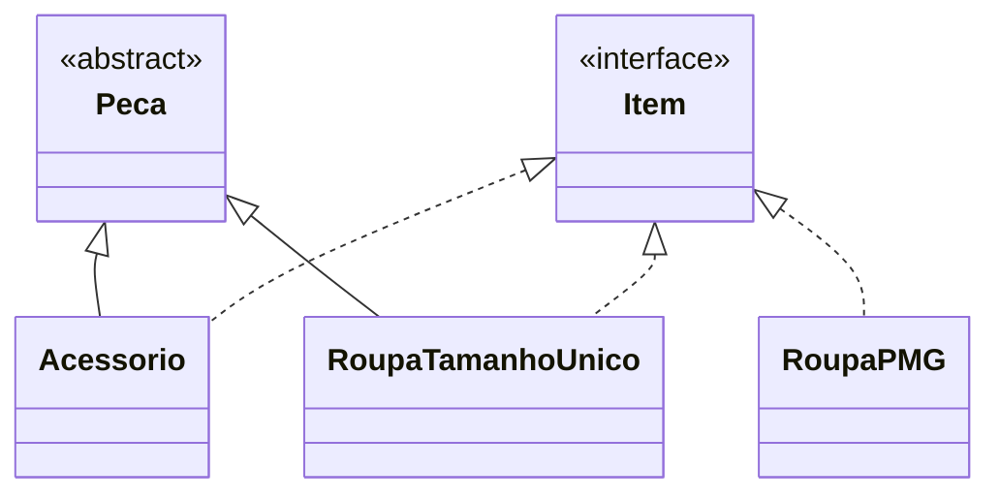

# Sistema de Estoque de Vestuário

Projeto de estudo em **Java** que modela o estoque de roupas e acessórios para praticar
**Programação Orientada a Objetos (POO)**. A proposta é representar produtos com estoque único
ou separado por tamanho, explorando interfaces, classes abstratas e herança.

> **Status:** em desenvolvimento. A versão atual contém a modelagem inicial e uma aplicação
> que instancia cinco produtos em memória. O fluxo interativo de vendas ainda não está integrado.

## Objetivo

Uma loja de vestuário precisa acompanhar produtos com características diferentes: um acessório
possui uma quantidade total disponível, enquanto uma roupa pode ter quantidades específicas
para os tamanhos P, M e G.

O projeto parte desse cenário para trabalhar a organização de responsabilidades e o
reaproveitamento de código, mantendo a implementação pequena e fácil de estudar.

## Tecnologias

- **Java:** linguagem utilizada em todas as classes.
- **Biblioteca padrão:** uso de `Scanner` para leitura de entrada no método de venda de acessórios.
- **Armazenamento em memória:** objetos reunidos em um array `Item[]`.
- **Sem dependências externas:** os arquivos fornecidos não utilizam frameworks ou bibliotecas adicionais.

## Estado atual

| Recurso | Implementação atual |
| --- | --- |
| Produtos de exemplo | Cinco objetos criados em `APP.main` |
| Acessórios | Quantidade total e método de venda com leitura pelo terminal |
| Roupas de tamanho único | Quantidade total e método que desconta uma unidade |
| Roupas P/M/G | Quantidades separadas por tamanho; método de venda pendente de correção |
| Limites de estoque | Atributos de mínimo e máximo nos modelos |
| Reposição | Métodos iniciais, ainda sem integração ao fluxo principal |
| Menu e persistência | Ainda não implementados |

Os métodos de venda existentes não são chamados por `APP.main`. Portanto, executar a aplicação
atualmente cria os produtos e encerra o programa, sem imprimir mensagens ou solicitar entradas.

## Modelagem e conceitos de POO



| Conceito | Aplicação no código |
| --- | --- |
| Abstração | `Peca` concentra atributos comuns e declara o método abstrato `Venda()` |
| Herança | `Acessorio` e `RoupaTamanhoUnico` estendem `Peca` |
| Sobrescrita | As subclasses fornecem implementações próprias de `Venda()` |
| Interface | `Item` fornece um tipo comum às três categorias de produto |
| Polimorfismo de tipos | `Item[]` armazena objetos de classes diferentes |
| Acesso ao estado | `Peca` oferece getters e setters para as quantidades e os limites de estoque |

A interface `Item` ainda não declara métodos. Assim, permite agrupar os produtos, mas ainda não
oferece um contrato comum para executar vendas por meio de uma referência `Item`.

## Arquivos e responsabilidades

Todos os arquivos Java declaram o pacote `sistemaEstoque`.

| Arquivo | Responsabilidade |
| --- | --- |
| `APP.java` | Ponto de entrada e criação dos produtos de exemplo |
| `Item.java` | Interface comum às categorias de produto |
| `Peca.java` | Classe abstrata com descrição, estoque, limites e comportamento comum |
| `Acessorio.java` | Especialização de peça para acessórios |
| `RoupaTamanhoUnico.java` | Especialização de peça para roupas sem variação de tamanho |
| `RoupaPMG.java` | Modelo com quantidades independentes para P, M e G |

## Como executar

É necessário ter um **JDK** instalado, com os comandos `java` e `javac` disponíveis no terminal.

```bash
java -version
javac -version
```

Depois de baixar ou clonar o repositório, abra o terminal na pasta que contém os seis arquivos
`.java` e execute:

```bash
javac -encoding UTF-8 -d out APP.java Item.java Peca.java Acessorio.java RoupaTamanhoUnico.java RoupaPMG.java
java -cp out sistemaEstoque.APP
```

A opção `-encoding UTF-8` preserva os caracteres acentuados presentes no código. A opção `-d out`
organiza os arquivos compilados de acordo com o pacote declarado.

Se os arquivos estiverem em `src/sistemaEstoque`, execute a compilação a partir da raiz:

```bash
javac -encoding UTF-8 -d out src/sistemaEstoque/*.java
java -cp out sistemaEstoque.APP
```

**Resultado esperado nesta versão:** o programa encerra sem saída no terminal. Não há menu implementado.

## Dados de exemplo

O ponto de entrada cria os seguintes produtos:

| Produto | Categoria | Quantidade inicial | Mínimo | Máximo |
| --- | --- | --- | ---: | ---: |
| Cinto Casual | Acessório | 15 | 5 | 30 |
| Cachecol Lã | Tamanho único | 10 | 3 | 20 |
| Camiseta Listrada | P/M/G | P: 2 · M: 5 · G: 15 | 5 | 5 |
| Pulseira Dourada | Acessório | 30 | 10 | 50 |
| Calça de Moletom | P/M/G | P: 3 · M: 6 · G: 9 | 3 | 12 |

Esses valores reproduzem a inicialização atual. A camiseta possui quantidades acima do máximo
configurado, um caso que evidencia a necessidade de validar os dados de entrada.

## Limitações conhecidas

- `RoupaPMG.venda()` possui um laço cuja condição inicial é falsa; atualmente retorna `0`
  sem processar a venda. Também é necessário corrigir a comparação de strings, a seleção
  do estoque G e a atualização das quantidades.
- As vendas não validam quantidade negativa ou disponibilidade, permitindo estoque inconsistente.
- A reposição em `Peca` retorna a quantidade calculada, mas depende de atribuição pelo chamador
  para atualizar o estado. Em `RoupaPMG`, a cadeia `if/else if` repõe apenas um tamanho por chamada.
- A leitura pelo terminal está dentro de classes de domínio e ainda precisa ser separada da regra de negócio.
- Os arquivos atuais não incluem testes automatizados, persistência ou documentação Javadoc.
- 
## Aprendizados trabalhados

O projeto exercita a escolha entre herança e interface, a representação de diferentes produtos
por um tipo comum e a identificação de comportamentos compartilhados. A próxima etapa é transformar
essa modelagem inicial em um fluxo de estoque verificável, com contratos claros e validação das regras.
